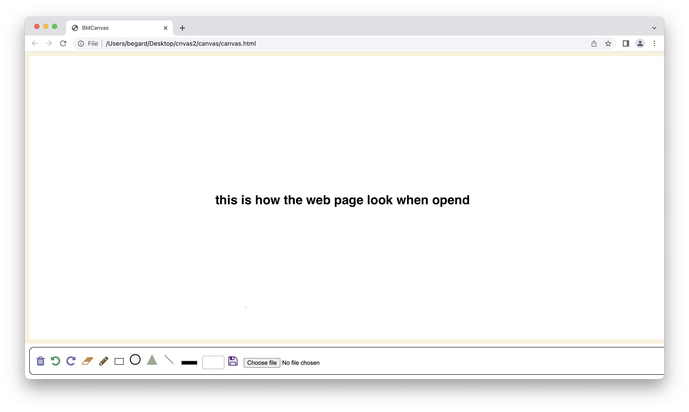
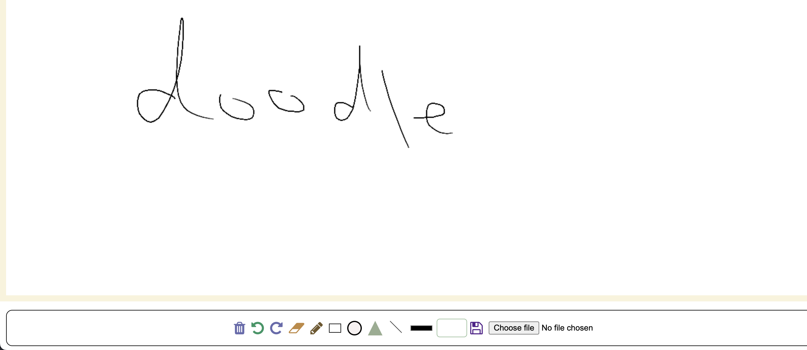
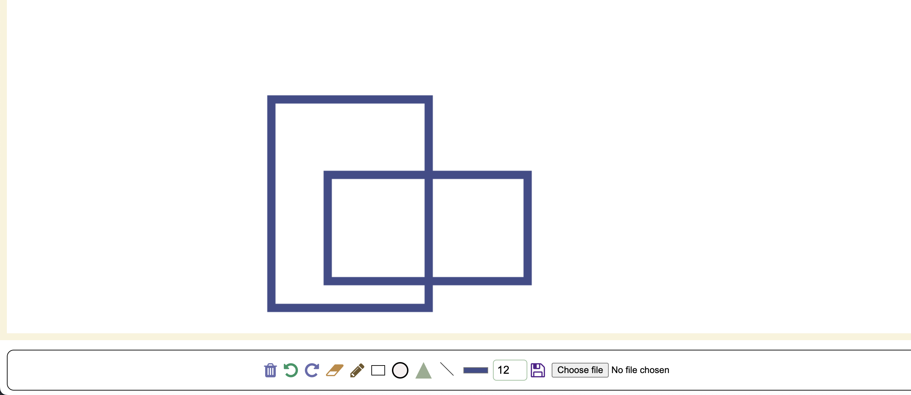
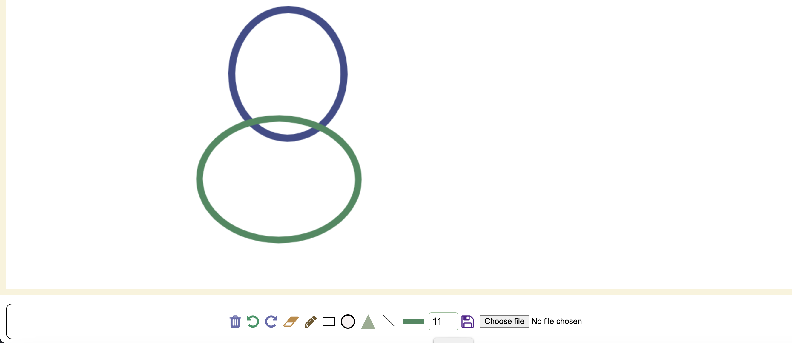
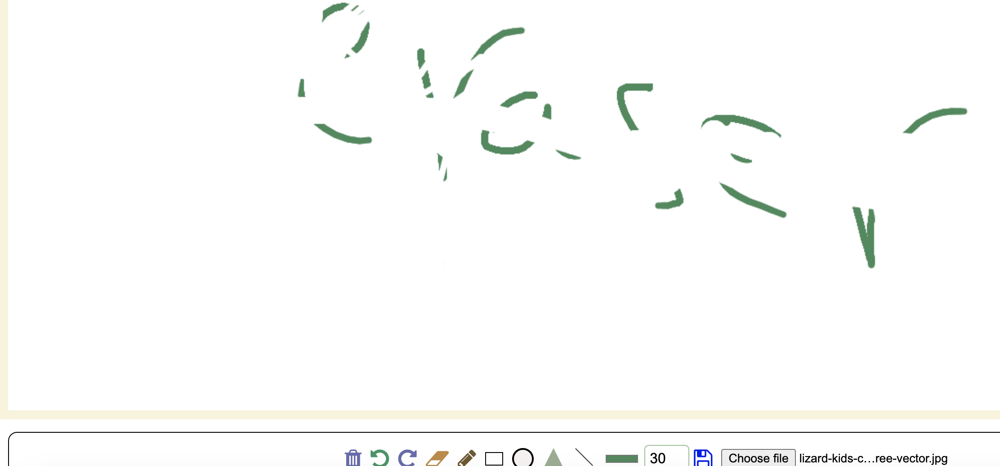
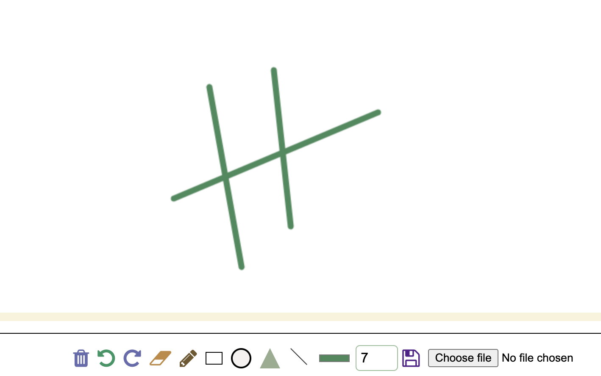
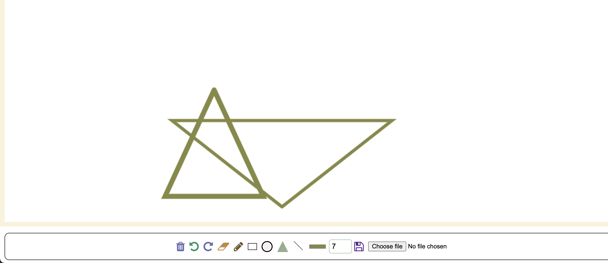
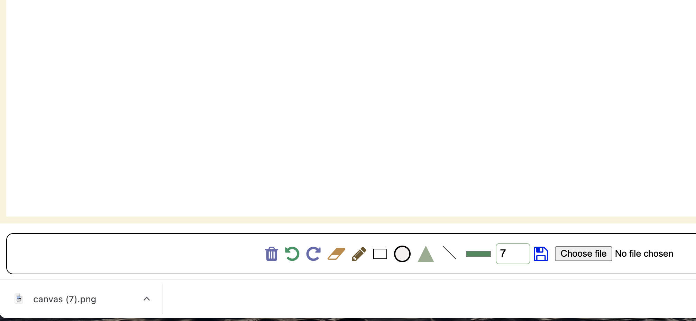

# What the Project is about?
This is a simple responsive Drawing website on canvas built using HTML, CSS,JavaScript. The website allows you to draw any picture or designe using mouse and touch screen. I added color pallet and line width to change the color and the width of your line as desired. besides doodling, I have added some geometric shape buttons such as ( rectangle,circle,triangle,straight line) to help you with your plans. All the shapes reacts with the color pallet and line width to have varios options. Moreover, I added a few more buttons such as ( clear canvas,undo,redo,eraser) to help you fix any mistake during your drawing. As soon as you finished your project you can save it automaticly on your device as a picture. Another feature I added was uplouding a picture to edit it if required.

## Design
This is  a picture of the website showing the full canvas with the tools bar. The tool bar was positioned in the center bottom of the page as belived would more comfortable or user to be in that posotion.
I used picturse instead of texts to discribe each buttns function. The icons (Trash, undo,redo, eraser, pencil, save) were used from w3school and set the colors acording my prefrance as showen in the screenshot https://www.w3schools.com/icons/ . However, I found it mor e appropreat to use css for icons(square,cercle,triangle) and I used How to -CSS shape https://www.w3schools.com/howto/howto_css_shapes.asp as shown in the link.

## Where it works

The website was tested on (Chrome,Safari,Microsoft Edge ) and works perfectly on tablet and mobile phone devices and it is responsive. However, it is recomended to be used on big screen due to the nature of the website that needs space on the screen to do your drawing on it.

## tests with mouse
| Test Case | Test & Procedure| Expected Outcome | Actual outcome | Required action|
| :-------: | :-------------: | :--------------: | :------------: | :------------: | 
| 1         | Verify that link works | The website opens| test Passed| N/A         |  
| 2         | Verify that draws with mouse| drawing oncanvas| test Passed| N/A     |  
| 3        | Verify that color changes | color of the line change acording to the chosen color| test Passed| N/A          |
| 4         | Verify that width of line changes | The width of line changes acording to the number chosen| test Passed| N/A          |  
| 5       | Verify that bin button works  | The canvas cleard completly| test Passed| N/A          |  
| 6         | Verify that undo button works | gose back one action| test Passed| N/A          |  
| 7         | Verify that redo button works | goes forward one action after undo| test Passed| N/A          |  
| 8        | Verify that eraser button works |erase the spot you clicking on| test Passed| N/A          |  
| 9         | Verify that size of eraser changes with line width size value | The size of clareing area changes| test Passed| N/A          |  
| 10       | Verify that pencil button change to doodle again | draw on the canvas| test Passed| N/A          |  
| 11       | Verify that rectangle button works | draw rectangle on the canvas| test Passed| N/A          |  
| 12       | Verify that cercle button works | draw cercle on the canvas| test Passed| N/A          |  
| 13       | Verify that triangle button works | draw triangle on canvas| test Passed| N/A          |  
| 14       | Verify that straight line button works| draw stright line| test Passed| N/A          |  
| 15       | Verify that save button works | save the image in the device| test Passed| N/A          |  
| 16       | Verify that uploading button works | uploads an image in to the canvas| test Passed| N/A          |  

## tests with touch screen
| Test Case | Test & Procedure| Expected Outcome | Actual outcome | Required action| Screenshot of the test|
| :-------: | :-------------: | :--------------: | :------------: | :------------: | :-------------------: | 
| 1        | Verify that  draws with tuchscreen| drawing on the canvas| test Passed| N/A          |  |
| 2       | Verify that pencil button change to doodle again | draw on the canvas| test Passed| N/A          |  |
| 3       | Verify that rectangle button works | draw a rectangle on the canvas| test Passed| N/A          |  |
| 4       | Verify that cercle button works | draw a cercle on the canvas| test Passed| N/A          |  |
| 5       | Verify that triangle button works | draw a triangle on canvas| test Passed| N/A          |  |
| 6      | Verify that straight line button works| draw a stright line| test Passed| N/A          |  |
| 7        | Verify that eraser button works |erase the spot you clicking on| test Passed| N/A          |  |

## screenshots

## Who can use it
The Website was created to be as simple as it can be to serve the maximum amount of users and the recomended age is 4+.

## How it works
the website is not very defftent from other common canvas app or programs. you have all the canvas to draw on and buttons that their appearence discribes its function to be used to make your drawing eassier.

# Live link for the website
https://b-mohammed2.github.io/