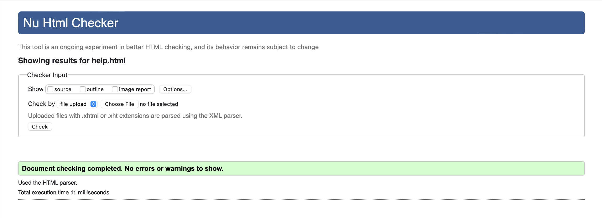

# Navigation
- [Introduction](#introduction)
- [User Stories](#user-stories) 
- [Design](#Design)
- [Wireframe](#Wireframe)
- [Functionality](#Functionality)
- [Testing](#Testing)
- [Compatibility](#Compatibility)
- [Bugs and Issues](#Bugs-and-Issues)
- [Screenshots](#Screenshots)
- [Validation](#Validation)
- [Usage](#Usage)
- [Acknowledgments](#Acknowledgments)
- [Deployment](#Deployment)
- [Live link for the website](#Live-link-for-the-website)

## Introduction
This is a simple responsive Drawing website on Canvas built using HTML, CSS, and JavaScript. The website allows you to draw any picture or design using a mouse and touch screen. I added a color pallet and line width to change the color and the width of your line as desired. besides doodling, I have added some geometric shape buttons such as ( rectangles, circles, triangles, and straight lines) to help you with your plans. All the shapes react with the color pallet and line width to have various options. Moreover, I have added a few more buttons such as ( clear canvas, undo, redo and eraser) to help you fix any mistakes during your drawing. Once you have finished your project you can save it automatically on your device as a picture.

## User Stories
I want to use a web application that allows me to draw and make amendments to images,
So that I can express my creativity and edit images conveniently.

Acceptance Criteria:

Scenario 1: Drawing on Canvas
Given that I am on the web application's canvas page,
When I select the drawing tool,
Then I should be able to draw freehand on the canvas using my mouse or touch input.

Scenario 2: Undo and Redo Actions
Given that I have drawn something on the canvas,
When I click on the "Undo" button, the previous action should be undone and revert the canvas to its previous state.
And if I click on the "Redo" button, the undone action should be restored, bringing the canvas back to the modified state.

Scenario 3: Erasing
Given that I am on the canvas page,
When I select the eraser tool,
Then I should be able to erase specific parts of the drawing or image on the canvas, providing the ability to correct mistakes or remove unwanted elements.

Scenario 4: Shape Drawing
Given that I am on the canvas page,
When I select any geometric shape from the toolbar such as (a square, circle, or triangle),
I should be able to draw the selected shape on the canvas by clicking and dragging, allowing me to create geometric shapes effortlessly.

Scenario 5: Drawing Straight Lines
Given that I am on the canvas page,
When I select the straight-line tool,
Then I should be able to draw straight lines by clicking and dragging on the canvas, enabling me to create precise and aligned elements.

Scenario 6: Choosing Colors
Given that I am on the canvas page,
When I select the color picker tool,
Then I should be able to choose a desired color for my drawings or shapes, providing me with a wide range of color options for creative expression.

Scenario 7: Adjusting Line Width
Given that I am on the canvas page,
When I use the line width slider,
Then I should be able to adjust the thickness of lines and shapes on the canvas, allowing me to create drawings with varying line widths and styles.

Scenario 8: Saving Images
Given that I am on the canvas page,
when I click on the "Save Image" button,
The current canvas image should be saved to a file format of my choice (such as PNG or JPEG), to allow me to download and share my artwork.

Scenario 9: Uploading Images
Given that I am on the canvas page,
When I click the "Upload Image" button,
I should be able to select an image file from my device and have it displayed on the canvas, to enable me to edit and make amendments to existing images.

Scenario 10: Help and Instructions
Given that I am on the canvas page,
when I click on the "Help" button,
I should be introduced to instructions in a window or dialog box. Moreover, it should contain tips, and information on how to use the various tools and features of the application, providing me with guidance and support during my creative process.

## Design
This web application was designed to provide a smooth and simple interface that allows the user to express their creativity and appropriately edit images. 

1. Responsiveness and Layout of the web app: The web is designed with a responsive layout to adapt to different screen sizes and devices. This aspect provides users with a variety of options to access the app from desktop computers, tablets, and smartphones.

2. Canvas features: The core functionality of the web app revolves around a canvas element. This canvas serves as a virtual drawing board where users can freely create their artwork using a mouse or touch screen. The canvas is designed to be interactive and responsive, providing a smooth drawing experience.

3. Color Palette and Line Width: To enhance the drawing capabilities, the web app incorporates a color palette and line width options. Users can select any color from a range of choices, to add vibrancy and variety to their artwork. Moreover, the line width provides control over the thickness of strokes.

4. Shapes: The web app provides buttons for some geometric shapes, such as rectangles, circles, triangles, and straight lines. These shape buttons enable users to incorporate structured elements into their designs effortlessly. Each shape is dynamically linked to the selected color from the palette and adapts to the chosen line width, offering versatility and creative possibilities.

5. Extra Drawing Tools: The web app provides other drawing tools such as clearing the canvas, undoing and redoing actions, and an eraser for precise edits to assist users. These features enable users to correct mistakes, refine their artwork, and experiment with different ideas effectively.

6. Uploading Image and Editing: The web app offers the capability to edit images by uploading the desired image to the canvas using the upload button.

7. Save Button: After completing the project you can save the canvas as an image on your device automatically by clicking on the save button.

## Wireframe
Design for the desktop screen.

Design for the tablet and iPad screen.

Design for the smartphone screen devices.

## Functionality
This web application offers the user a range of functionality that helps the user to draw and edit images easily. The key functionality that it offers are:
* Draw: The main functionality of this project is the ability to draw on the canvas. Users can draw on the canvas using a mouse or touchscreen to create artwork or amend it.
* Color: Another functionality the web app offers is the color pallet allowing users to choose from a wide range of colors.
* Line width: users can change the line width of all drawing tools including the eraser to give them more control on the canvas.
* Drawing geometric shapes: Users can draw geometric shapes easily with the buttons provided in the web app such as (Rectangles, triangles, circles, and straight lines). they can add these shapes to their project by selecting the desired shape and placing it on the canvas. The chosen shapes inherit the selected color and line width to provide consistent design elements.
* Editing Tools: The web app includes other buttons such as (Clear the canvas, Undo actions, Redo actions, eraser for detailed editing) actions to enhance the user's drawing experience.
* Uploading image for editing: The web app includes an Upload button to upload images from their device to the canvas for modification and editing. 
* Saving drawing: When users finished their artwork, this feature allows the user to save the work as an image file on their device and share their creations.

## Testing
From the begining of the project tests has been carried out step by step with the development of the web application. However, after finishing the project I have made further testes and this are the processes:

## Automated testing

### Lighthouse test
The web app was tested on Lighthouse for categories performance,accessibility,bestpractices,SEO(search Engine Optimization) for Mobile devices and Desktop. 
This is the report as in the images:
#### Desktop

#### Mobile 

### Validation test
The codes has been tested using those tools:
#### jslint 
 This is the link to the validator webpage https://www.jslint.com. As shown in the screenshot there are no errors. however, there are 37 warnings. They are mostly to do with the structure of the program. I tried to fix them. However, it keeps increasing with any correction and with all these changes it costs the program to crash. Another reason for not correcting is that the program is running properly and have no problem.
 

#### JS hint 
 This is another Javascript code validator https://jshint.com to support my project.
Result: the same as jslint only warnings and no error detected. this is the image of the result

#### html validator
The HTML codes for index.html and help.html were tested via w3c validator. There were no error detected.This is the link to the validator webpage https://validator.w3.org. 

#### CSS validator
The CSS codes for canvas.css was tested via jigsaw validator.
Result: there were no errors detected.
This is the link to the validator webpagehttps://jigsaw.w3.org/css-validator/validator

## Testing responsiveness
The responsiveness of the web app was tested Manually and on google chrome developer tools responsiveness testing.
### Manual testing
The web app was tested on different devices such as laptop,smart phone,ipad.
| Test Case | Test & Procedure| Device |  Outcome |Screenshots|
| :-------: | :-------------: | :--------------: | :------------: |:------------: |
| 1 | Responsiveness | Laptop | Passed the test||
| 2 | Responsiveness | iPad | Passed the test||
| 3 | Rotation | ipad| Passed the test||
| 4 | Responsiveness | smartphone | Passed the test||
| 5 | Rotation | smartphone | Passed the test||

### Google chrome Developer Tools testing
|| |   |
| :-------------: | :--------------: | :------------: |:------------: |

### tests with mouse
| Test Case | Test & Procedure| Expected Outcome | Actual outcome | Required action|
| :-------: | :-------------: | :--------------: | :------------: | :------------: | 
| 1         | Verify that link works | The website opens| test Passed| N/A         |  
| 2         | Verify that draws with mouse| Drawing on anvas| test Passed| N/A     |  
| 3        | Verify that color changes | Color of the line change according to the chosen color| test Passed| N/A          |
| 4         | Verify that width of line changes | The width of line changes according to the number chosen| test Passed| N/A          |  
| 5       | Verify that bin button works  | The canvas cleared completly| test Passed| N/A          |  
| 6         | Verify that undo button works | goes back one action| test Passed| N/A          |  
| 7         | Verify that redo button works | goes forward one action after undo| test Passed| N/A          |  
| 8        | Verify that eraser button works |erase the spot you clicking on| test Passed| N/A          |  
| 9         | Verify that the size of the eraser changes with the line width size value | The size of the clearing area changes| test Passed| N/A          |  
| 10       | Verify that pencil button change to doodle again | draw on the canvas| test Passed| N/A          |  
| 11       | Verify that rectangle button works | draw rectangle on the canvas| test Passed| N/A          |  
| 12       | Verify that circle button works | draw circle on the canvas| test Passed| N/A          |  
| 13       | Verify that triangle button works | draw triangle on canvas| test Passed| N/A          |  
| 14       | Verify that straight line button works| draw straight line| test Passed| N/A          |  
| 15       | Verify that save button works | save the image in the device| test Passed| N/A          |  
| 16       | Verify that uploading button works | uploads an image in to the canvas| test Passed| N/A          |  

## tests with touch screen
| Test Case | Test & Procedure| Expected Outcome | Actual outcome | Required action| Screenshot of the test|
| :-------: | :-------------: | :--------------: | :------------: | :------------: | :-------------------: | 
| 1        | Verify that  draws with tuchscreen| drawing on the canvas| test Passed| N/A          |  |
| 2       | Verify that pencil button change to doodle again | draw on the canvas| test Passed| N/A          |  |
| 3       | Verify that rectangle button works | draw a rectangle on the canvas| test Passed| N/A          |  |
| 4       | Verify that cercle button works | draw a cercle on the canvas| test Passed| N/A          |  |
| 5       | Verify that triangle button works | draw a triangle on canvas| test Passed| N/A          |  |
| 6      | Verify that straight line button works| draw a stright line| test Passed| N/A          |  |
| 7        | Verify that eraser button works |erase the spot you clicking on| test Passed| N/A          |  |

## Compatibility

The website was tested on (Chrome, Safari, and Microsoft Edge ) and works perfectly on tablet and mobile phone devices and it is responsive. However, it is recommended to be used on a big screen due to the nature of the website that needs space on the screen to do your drawing on it.

## Bugs and Issues
1. Eraser: When I tried to set the eraser on the drawing white line it failed as it was showing as a white line after saving. Therefore, I used (globalCompositeOperation = "destination-out") from W3school website.
2. ImagePointer: it is for saving the canvas as an image with every mouse up. when the mouse coming out from the canvas was counted as a mouse up as well. Therefore I added if condition of (painting == true) to convert canvas to image function.

## screenshots

## Who can use it
The Website was created to be as simple as it can be to serve the maximum amount of users and the recommended age is 4+.

## How it works
the website is not very different from other common canvas apps or programs. you have all the canvas to draw on and buttons that their appearance describes its function to be used to make your drawing easier.

## Acknowledgments

I would like to express my sincere gratitude and acknowledge the following resources for their valuable contributions to this project:

- [**Flaticon**](https://www.flaticon.com) and [**Font Awesome**](https://fontawesome.com): I extend my special thanks to Flaticon and Font Awesome for providing an extensive collection of high-quality icons used in the toolbar of our application. These icons have greatly enhanced the visual appeal and functionality of the project.

- [**OpenAI's ChatGPT**](https://chat.openai.com): I would like to express our deep appreciation to OpenAI's ChatGPT for providing invaluable assistance and guidance throughout the development of this project. ChatGPT has been instrumental in answering our questions, providing explanations, and offering solutions, making this project possible.

- [**Mozilla Developer Network**](https://developer.mozilla.org/en-US/docs/Web/JavaScript): I would like to acknowledge the Mozilla Developer Network (MDN) for its comprehensive and reliable documentation on JavaScript. MDN has served as an essential resource, providing in-depth explanations, examples, and references, enabling us to leverage the power of JavaScript effectively.

- [**W3Schools**](https://www.w3schools.com): I express my appreciation to W3Schools for their informative and user-friendly tutorials and references. W3Schools has been an invaluable resource, providing me with practical examples and guidance on various web development topics, including HTML, CSS, and JavaScript.
- [**draw.io**](https://app.diagrams.net) : Thanks to this website drawing the wireframe was easier and more professional.

I'm grateful for the contributions of these resources, which have significantly enriched this project and helped in achieving my goals.

##  How to deploy
I deploy the website according to the steps in this link:
https://docs.github.com/en/pages/quickstart#

# Live link for the website

https://b-mohammed2.github.io/canvas/