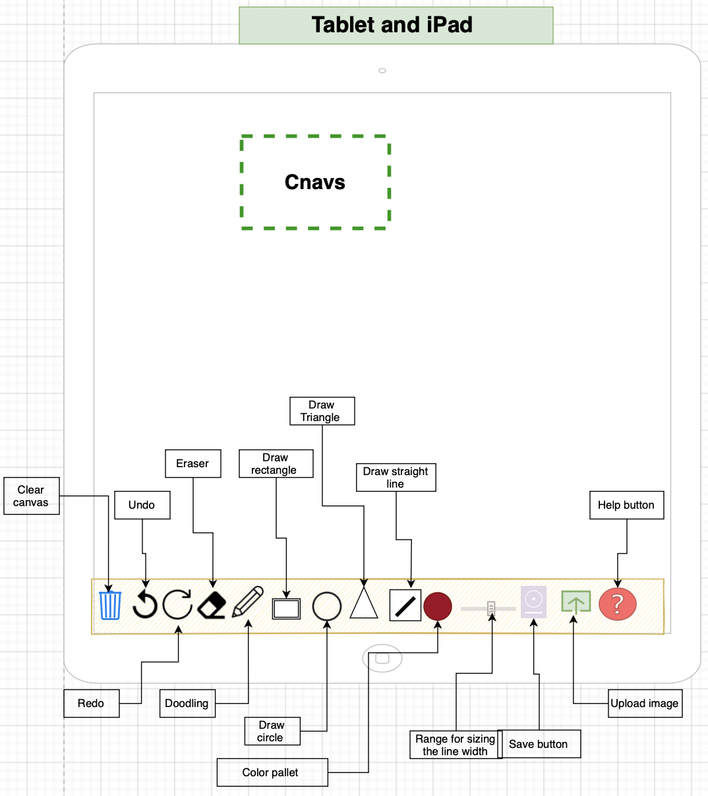

# What the Project is about?
This is a simple responsive Drawing website on canvas built using HTML, CSS,JavaScript. The website allows you to draw any picture or designe using mouse and touch screen. I added color pallet and line width to change the color and the width of your line as desired. besides doodling, I have added some geometric shape buttons such as ( rectangle,circle,triangle,straight line) to help you with your plans. All the shapes reacts with the color pallet and line width to have varios options. Moreover, I added a few more buttons such as ( clear canvas,undo,redo,eraser) to help you fix any mistake during your drawing. As soon as you finished your project you can save it automaticly on your device as a picture. Another feature I added was uplouding a picture to edit it if required.

User Story: Drawing and Image Amendment Web Application

## User stories
I want to use a web application that allows me to draw and make amendments to images,
So that I can express my creativity and edit images conveniently.

Acceptance Criteria:

Scenario 1: Drawing on Canvas
Given that I am on the web application's canvas page,
When I select the drawing tool,
Then I should be able to draw freehand on the canvas using my mouse or touch input.

Scenario 2: Undo and Redo Actions
Given that I have made changes to the canvas,
When I click the "Undo" button,
Then the previous action should be undone, reverting the canvas to its previous state.
And when I click the "Redo" button,
Then the undone action should be restored, bringing the canvas back to the modified state.

Scenario 3: Erasing
Given that I am on the canvas page,
When I select the eraser tool,
Then I should be able to erase specific parts of the drawing or image on the canvas, providing the ability to correct mistakes or remove unwanted elements.

Scenario 4: Shape Drawing
Given that I am on the canvas page,
When I select a shape tool (such as square, circle, or triangle),
Then I should be able to draw the selected shape on the canvas by clicking and dragging, allowing me to create geometric shapes effortlessly.

Scenario 5: Drawing Straight Lines
Given that I am on the canvas page,
When I select the straight line tool,
Then I should be able to draw straight lines by clicking and dragging on the canvas, enabling me to create precise and aligned elements.

Scenario 6: Choosing Colors
Given that I am on the canvas page,
When I select the color picker tool,
Then I should be able to choose a desired color for my drawings or shapes, providing me with a wide range of color options for creative expression.

Scenario 7: Adjusting Line Width
Given that I am on the canvas page,
When I use the line width slider,
Then I should be able to adjust the thickness of lines and shapes on the canvas, allowing me to create drawings with varying line widths and styles.

Scenario 8: Saving Images
Given that I am on the canvas page,
When I click the "Save Image" button,
Then the current canvas image should be saved to a file format of my choice (such as PNG or JPEG), allowing me to download and share my artwork.

Scenario 9: Uploading Images
Given that I am on the canvas page,
When I click the "Upload Image" button,
Then I should be able to select an image file from my device and have it displayed on the canvas, enabling me to edit and make amendments to existing images.

Scenario 10: Help and Instructions
Given that I am using the web application,
When I click the "Help" button,
Then I should be presented with a window or dialog box containing instructions, tips, and information on how to use the various tools and features of the application, providing me with guidance and support during my creative process.

## Design
This is  a picture of the website showing the full canvas with the tools bar. The tool bar was positioned in the center bottom of the page as belived would more comfortable or user to be in that posotion.
I used picturse instead of texts to discribe each buttns function. The icons (Trash, undo,redo, eraser, pencil, save) were used from w3school and set the colors acording my prefrance as showen in the screenshot https://www.w3schools.com/icons/ . However, I found it mor e appropreat to use css for icons(square,cercle,triangle) and I used How to -CSS shape https://www.w3schools.com/howto/howto_css_shapes.asp as shown in the link.

## Wireframe
Design for the desktop screen.

Design for the tablet and iPad screen.

Design for the smartphone screen devices.

## Where it works

The website was tested on (Chrome,Safari,Microsoft Edge ) and works perfectly on tablet and mobile phone devices and it is responsive. However, it is recomended to be used on big screen due to the nature of the website that needs space on the screen to do your drawing on it.

## tests with mouse
| Test Case | Test & Procedure| Expected Outcome | Actual outcome | Required action|
| :-------: | :-------------: | :--------------: | :------------: | :------------: | 
| 1         | Verify that link works | The website opens| test Passed| N/A         |  
| 2         | Verify that draws with mouse| drawing oncanvas| test Passed| N/A     |  
| 3        | Verify that color changes | color of the line change acording to the chosen color| test Passed| N/A          |
| 4         | Verify that width of line changes | The width of line changes acording to the number chosen| test Passed| N/A          |  
| 5       | Verify that bin button works  | The canvas cleard completly| test Passed| N/A          |  
| 6         | Verify that undo button works | gose back one action| test Passed| N/A          |  
| 7         | Verify that redo button works | goes forward one action after undo| test Passed| N/A          |  
| 8        | Verify that eraser button works |erase the spot you clicking on| test Passed| N/A          |  
| 9         | Verify that size of eraser changes with line width size value | The size of clareing area changes| test Passed| N/A          |  
| 10       | Verify that pencil button change to doodle again | draw on the canvas| test Passed| N/A          |  
| 11       | Verify that rectangle button works | draw rectangle on the canvas| test Passed| N/A          |  
| 12       | Verify that cercle button works | draw cercle on the canvas| test Passed| N/A          |  
| 13       | Verify that triangle button works | draw triangle on canvas| test Passed| N/A          |  
| 14       | Verify that straight line button works| draw stright line| test Passed| N/A          |  
| 15       | Verify that save button works | save the image in the device| test Passed| N/A          |  
| 16       | Verify that uploading button works | uploads an image in to the canvas| test Passed| N/A          |  

## tests with touch screen
| Test Case | Test & Procedure| Expected Outcome | Actual outcome | Required action| Screenshot of the test|
| :-------: | :-------------: | :--------------: | :------------: | :------------: | :-------------------: | 
| 1        | Verify that  draws with tuchscreen| drawing on the canvas| test Passed| N/A          |  |
| 2       | Verify that pencil button change to doodle again | draw on the canvas| test Passed| N/A          |  |
| 3       | Verify that rectangle button works | draw a rectangle on the canvas| test Passed| N/A          |  |
| 4       | Verify that cercle button works | draw a cercle on the canvas| test Passed| N/A          |  |
| 5       | Verify that triangle button works | draw a triangle on canvas| test Passed| N/A          |  |
| 6      | Verify that straight line button works| draw a stright line| test Passed| N/A          |  |
| 7        | Verify that eraser button works |erase the spot you clicking on| test Passed| N/A          |  |

### problems and bugs
1. Eraser: When I tried to set the eraser on drawing white line it faild as it was showing as white line after saving.Therefor, I used (globalCompositeOperation = "destination-out") from w3school website.
2. ImagePointer: it is for saving the canvas as image with every mouse up. when the mouse coming out from the canvas was counted as a mouse up as well. Therefore I added if condition of (painting == true) for convert canvas to image function.

## screenshots

## Validation
#### jslint 
 This is the link to the validator webpage https://www.jslint.com. As shown in the screenshot there are no errors. however, there are 37 warrning. They are mostley to do with the structure of the program. I tried to fix them. However, it keeps increasing with any correction and with all these  changes it costs the program to crush. Another reason for not correcting is that the programe is running properly and have no  problem.
 

### JS hint 
No error detected https://jshint.com.

#### html validator

## Who can use it
The Website was created to be as simple as it can be to serve the maximum amount of users and the recomended age is 4+.

## How it works
the website is not very deffrent from other common canvas app or programs. you have all the canvas to draw on and buttons that their appearence discribes its function to be used to make your drawing eassier.

## Acknowledgments

We would like to express our sincere gratitude and acknowledge the following resources for their valuable contributions to this project:

- **Flaticon** (https://www.flaticon.com) and **Font Awesome** (https://fontawesome.com): We extend our special thanks to Flaticon and Font Awesome for providing an extensive collection of high-quality icons used in the tool bar of our application. These icons have greatly enhanced the visual appeal and functionality of our project.

- **OpenAI's ChatGPT**: We would like to express our deep appreciation to OpenAI's ChatGPT for providing invaluable assistance and guidance throughout the development of this project. ChatGPT has been instrumental in answering our questions, providing explanations, and offering solutions, making this project possible.

- **Mozilla Developer Network** (https://developer.mozilla.org/en-US/docs/Web/JavaScript): We would like to acknowledge the Mozilla Developer Network (MDN) for their comprehensive and reliable documentation on JavaScript. MDN has served as an essential resource, providing in-depth explanations, examples, and references, enabling us to leverage the power of JavaScript effectively.

- **W3Schools** (https://www.w3schools.com): We express our appreciation to W3Schools for their informative and user-friendly tutorials and references. W3Schools has been an invaluable resource, providing us with practical examples and guidance on various web development topics, including HTML, CSS, and JavaScript.

We are grateful for the contributions of these resources, which have significantly enriched our project and helped us in achieving our goals.

##  How to deploying
I deploy the website according to the steps in this link:
https://docs.github.com/en/pages/quickstart#

# Live link for the website

https://b-mohammed2.github.io/canvas/